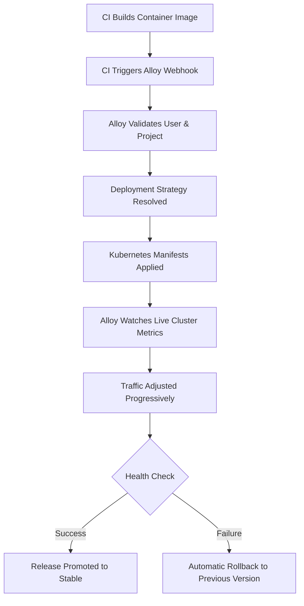

# 🎯 Alloy

### Kubernetes-Native Continuous Deployment Orchestration

**Safe production releases through automatic rollback and progressive traffic control**

[](https://github.com/yourusername/alloy)
[](https://go.dev/)
[](https://kubernetes.io/)
[](https://postgresql.org/)

**[Key Features](#-key-features) • [Architecture](#-architecture) • [Quick Start](#-getting-started) • [CI Integration](#-ci-integration-webhook-based) • [Deployment Strategies](#-deployment-strategies)**

</div>

---

## 🎯 Problem Statement

**How do we release frequently to production without breaking running applications?** [web:20]

Traditional deployment pipelines often fail at the most critical moment — production rollout. Common issues include:

- 💥 Breaking changes discovered too late
- 🌊 Immediate full-traffic exposure to untested code
- 🔥 Manual rollback under pressure and time constraints
- 📊 No visibility into release health metrics
- 🤷 Blind `kubectl apply` with no automated recovery

---

## 💡 The Solution

**Alloy** is a Kubernetes-native continuous deployment orchestration system designed to prevent last-minute production failures by providing safe releases, automatic rollback, and controlled traffic splitting [web:20][web:21].

Alloy sits between your CI system and Kubernetes, acting as an intelligent release controller that understands:

- ✅ **What** is being deployed
- 🎛️ **How** it should be deployed
- 🔄 **When** it should be rolled back

### Core Philosophy

> **CI builds artifacts. Alloy decides how they reach production.**

The orchestrator ensures every deployment is verified progressively and can automatically fall back to a stable version when something goes wrong [web:21].

---

## 🚀 Key Features

- **🎛️ Kubernetes-Native Design** — Built with official `client-go` SDK for real-time cluster communication [web:20]
- **🛡️ Automatic Rollback on Failure** — Detects issues and reverts to last known stable version instantly
- **📊 Progressive Traffic Splitting** — Gradually shifts traffic through canary stages (17% → 50% → 83% → 100%) [web:21]
- **🎯 Canary Deployments** — Minimize blast radius with stage-based rollouts [web:21]
- **🔄 Rolling Updates** — Zero-downtime releases with built-in rollback support [web:20]
- **💾 Stable Version Promotion** — Persistent release memory ensures known good state at all times
- **🔗 Webhook-Driven** — Native integration with any CI tool (GitHub Actions, GitLab CI, Jenkins, CircleCI)
- **🌐 API-First Control** — RESTful API for centralized release orchestration

---

## 🏗 Architecture

Alloy follows a controller-style architecture similar to native Kubernetes components [web:20].

### High-Level Flow

```text
┌─────────────┐
│   CI Tool   │
│ (Build/Test)│
└──────┬──────┘
       │ Webhook
       ▼
┌─────────────────────────┐
│   Alloy Orchestrator    │
│  ┌─────────────────┐   │
│  │ Deployment      │   │      ┌──────────────┐
│  │ Engine          │◄──┼─────►│ PostgreSQL   │
│  │ -  Strategy      │   │      │ Database     │
│  │ -  Health checks │   │      │ -  Metadata   │
│  │ -  Traffic rules │   │      │ -  History    │
│  └────────┬────────┘   │      └──────────────┘
└───────────┼────────────┘
            │ client-go SDK
            ▼
┌─────────────────────────┐
│ Kubernetes API Server   │
└────────┬────────────────┘
         │
    ┌────┴─────┬──────────┐
    ▼          ▼          ▼
┌────────┐ ┌────────┐ ┌────────┐
│ Canary │ │ Stable │ │Ingress/│
│  Pods  │ │  Pods  │ │  LB    │
└────────┘ └────────┘ └────────┘
```

### How It Works

1. **Trigger** — CI system completes build/tests and sends webhook to Alloy
2. **Validate** — Alloy verifies project and release metadata from database
3. **Orchestrate** — Communicates with Kubernetes using `client-go` SDK (not shell-based) [web:20]
4. **Monitor** — Continuously observes live cluster state (pod readiness, availability)
5. **React** — Makes deployment decisions in real-time without polling delays
6. **Decide** — Promotes to stable or executes automatic rollback based on health data

### Key Architectural Benefits

The orchestrator **does not replace Kubernetes** — it **controls Kubernetes resources intelligently** [web:20].

All communication happens via the official Kubernetes API layer, allowing Alloy to:
- Read live pod status in real-time
- Monitor readiness and availability metrics
- Detect rollout failures immediately
- React without polling delays

---

## 🚦 Deployment Strategies

### 1. Rolling Deployment

Standard zero-downtime deployment that gradually replaces old pods with new ones while maintaining service availability [web:20].

**Use case:** Routine updates with minimal risk

**Behavior:**
- Supports rollback to previous ReplicaSet
- Maintains continuous availability
- Kubernetes-native strategy

---

### 2. Canary Deployment

Deploys new version alongside stable and routes a small percentage of traffic, gradually increasing exposure based on health metrics [web:21][web:23].

**Use case:** High-risk or critical production releases

**Traffic Progression:**
```
10% → 25% → 50% → 100%
```

If metrics degrade at any step, **rollback is triggered automatically** [web:21].

#### Canary Traffic Model

Alloy uses stage-based canary progression with automated health verification at each stage [web:21][web:23]:

| Stage | Replicas | Traffic % | Observation Window |
|-------|----------|-----------|-------------------|
| **Stage 1** | 1 Pod | 17% | 3 minutes |
| **Stage 2** | 3 Pods | 50% | 3 minutes |
| **Stage 3** | 5 Pods | 83% | 2 minutes |
| **Promotion** | Full Cluster | 100% | Permanent |

#### Canary Execution Flow

```go
var canaryStages = []CanaryStage{
    {Replicas: 1, TrafficPct: 17, DurationMin: 3},
    {Replicas: 3, TrafficPct: 50, DurationMin: 3},
    {Replicas: 5, TrafficPct: 83, DurationMin: 2},
}
```

**Process:**
1. Deploy canary pods
2. Route partial traffic
3. Observe health metrics
4. Increase exposure per stage
5. Promote to stable on success
6. **Roll back immediately on failure**

This staged approach minimizes blast radius while allowing fast promotion [web:21].

---

### 3. Stable Promotion

Once a new version passes all health checks:
- It becomes the new **stable version**
- Old stable is archived for rollback capability
- Guarantees a **known good state** at all times

---

## 🔗 CI Integration (Webhook Based)

Alloy integrates with **any CI tool** through a simple HTTP/HTTPS webhook. Once CI completes successfully, the pipeline notifies Alloy to begin deployment orchestration.

### Webhook Endpoint

```
POST http://localhost:{PORT}/api/webhook/deploy
```

### Example: GitHub Actions

```yaml
name: Deploy to Production

on:
  push:
    branches: [main]

jobs:
  deploy:
    runs-on: ubuntu-latest
    steps:
      - name: Trigger Alloy Deployment
        run: |
          curl -X POST "http://http:{your_host}:{port}/api/webhook/deploy" \
            -H "Content-Type: application/json" \
            -d '{
              "user_id": "${{ secrets.ALLOY_USER_ID }}",
              "project_id": "${{ secrets.ALLOY_PROJECT_ID }}",
              "image_tag": "${{ github.sha }}",
              "commit_sha": "${{ github.sha }}",
              "strategy": "auto",
              "files": {
                "secret": "'"$(cat k8s/secret.yaml | base64)"'",
                "service": "'"$(cat k8s/service.yaml | base64)"'",
                "deployment": "'"$(cat k8s/deployment.yaml | base64)"'"
              }
            }'
```

### Request Payload

```bash
curl -X POST "http://localhost:8080/api/webhook/deploy" \
  -H "Content-Type: application/json" \
  -d '{
    "user_id": "USER_ID",
    "project_id": "PROJECT_ID",
    "image_tag": "v1.2.3",
    "commit_sha": "abc123def",
    "strategy": "auto",
    "files": {
      "secret": "<secret-yaml>",
      "service": "<service-yaml>",
      "deployment": "<deployment-yaml>"
    }
  }'
```

### Request Fields

| Field | Description | Required |
|-------|-------------|----------|
| `user_id` | User identifier stored in Alloy DB | ✅ Yes |
| `project_id` | Project identifier stored in Alloy DB | ✅ Yes |
| `image_tag` | Container image tag built by CI | ✅ Yes |
| `commit_sha` | Git commit reference | ✅ Yes |
| `strategy` | Deployment strategy (`auto`, `rollout`, `canary`) | Optional (default: `auto`) |
| `files` | Kubernetes manifests (Secret, Service, Deployment) | ✅ Yes |

> **Note:** The `user_id` and `project_id` must already exist in Alloy's database, created during Docker Compose setup.

---

## 🎛️ Deployment Strategy Options

The `strategy` field is **optional** and **strongly recommended to be left as `auto`**.

| Strategy | Behavior | Use Case |
|----------|----------|----------|
| **`auto`** ⭐ | First deployment → `rollout`<br>Subsequent releases → `canary` | **Recommended** for all production workloads |
| `rollout` | Immediate full traffic shift<br>Old version replaced | Bootstrap deployments, internal services |
| `canary` | Force canary deployment<br>Progressive traffic increase | High-risk releases requiring manual control |

### Why `auto` is Recommended

The `auto` strategy provides the best balance:
- **Fast bootstrapping** for initial deployment
- **Safety enforcement** for subsequent releases
- **Automatic risk assessment** based on deployment history

---

## 🛠 Getting Started

### Prerequisites

- **Kubernetes cluster** (v1.24+)
- **Docker** and **Docker Compose**
- **kubectl** configured with cluster access
- **PostgreSQL** (included in Docker Compose)

### Quick Setup

**1. Clone the repository**

```bash
git clone https://github.com/minimon-cd/Alloy-core.git
cd Alloy-core
```

**2. Configure environment**

Create a `.env` file:

```env
# Alloy Orchestrator Settings
APP_PORT=8080
APP_ENV=production

# Database Configuration
DB_HOST=postgres
DB_PORT=5432
DB_USER=alloy_admin
DB_PASSWORD=your_secure_password_here
DB_NAME=alloy_orchestrator
```

**3. Deploy with Docker Compose**

```bash
docker-compose up -d
```

**4. Verify installation**

```bash
# Check API health
curl http://localhost:8080/health

# Check database connection
docker-compose logs alloy-api
```

### Docker Compose Configuration

```yaml
version: '3.8'

services:
  alloy-api:
    image: alloy/orchestrator:latest
    ports:
      - "${APP_PORT}:8080"
    environment:
      - DATABASE_URL=postgres://${DB_USER}:${DB_PASSWORD}@${DB_HOST}:${DB_PORT}/${DB_NAME}?sslmode=disable
    depends_on:
      - postgres
    restart: unless-stopped

  postgres:
    image: postgres:15-alpine
    environment:
      POSTGRES_USER: ${DB_USER}
      POSTGRES_PASSWORD: ${DB_PASSWORD}
      POSTGRES_DB: ${DB_NAME}
    volumes:
      - alloy_storage:/var/lib/postgresql/data
    restart: unless-stopped

volumes:
  alloy_storage:
```

---

## 🆚 Why Alloy?

### vs. Direct `kubectl apply`

**Problem with kubectl:**
- Blind updates with no health awareness
- No automatic rollback capability
- No traffic control
- No deployment memory
- Failure handling is completely manual

**Alloy introduces decision-making on top of Kubernetes** [web:20].

---

### vs. Pure CI Pipelines

CI systems are designed to:
- ✅ Build artifacts
- ✅ Run tests
- ✅ Push images

**They are NOT designed to manage live production state.**

CI tools lack:
- ❌ Real-time Kubernetes awareness
- ❌ Continuous observation loops
- ❌ Progressive traffic control
- ❌ Automated decision-making

**Alloy separates concerns clearly:**
- **CI** → Builds
- **Alloy** → Releases

---

### vs. Argo Rollouts

| Area | Argo Rollouts | Alloy |
|------|---------------|-------|
| **Trigger Model** | GitOps | Webhook-based |
| **CI Integration** | Indirect | Native |
| **Release Memory** | Limited | Persistent DB |
| **Decision Logic** | Declarative | Programmatic |
| **Primary Goal** | Rollout mechanics | Release orchestration |

**Argo Rollouts** focuses on deployment mechanics within GitOps workflows.

**Alloy** focuses on release orchestration with CI-driven, API-first control.

### Alloy is Ideal For Teams That Need:

- 🎯 CI-driven deployments
- 🔌 API-first control
- 🧠 Centralized release logic
- 🛡️ Automatic recovery mechanisms
- 📊 Persistent deployment history

---

## 📊 Deployment Flow



---

## 🗺️ Roadmap

- [ ] **Multi-cluster support** — Deploy across multiple Kubernetes clusters
- [ ] **Slack/Discord notifications** — Real-time deployment status updates
- [ ] **Custom health check plugins** — Extensible health verification
- [ ] **Blue-Green deployment strategy** — Complete environment switching
- [ ] **Metrics integration** — Prometheus/Grafana dashboards
- [ ] **RBAC support** — Role-based access control for deployments
- [ ] **Web UI dashboard** — Visual deployment monitoring and control

---
